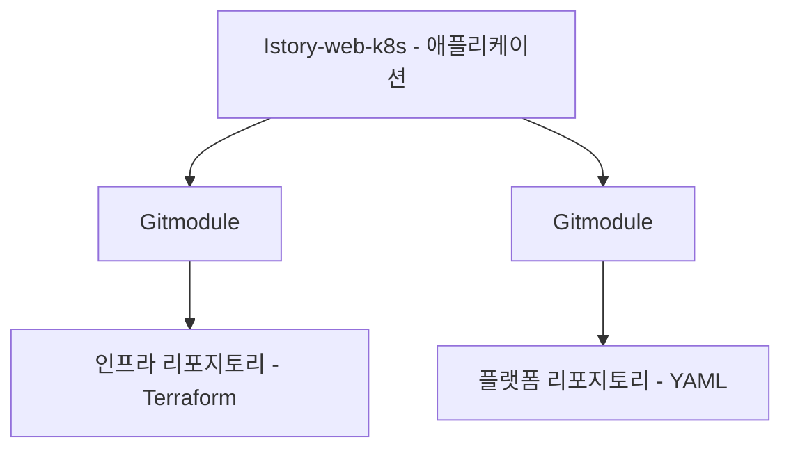

## 1. 리포지토리 구조
리포지토리 구조는 아래와 같습니다.


<br>
<br>

| 리포지토리 명 | 주소 | 구현언어 | 리포지토리 타입 |
| ------------- | ---- | --------- | ---------- |
| 애플리케이션 리포지토리      | https://github.com/dangtong76/istory-web-k8s.git | JAVA | Main |
| 인프라 리포지토리     | https://github.com/dangtong76/istory-infra.git | Terraform | Module |
| 플랫폼 리포지토리     | https://github.com/dangtong76/istory-platform.git | YAML | Module |

## 2. 리포지토리 구성하기
- 리포지토리 기본 구조
```bash
xinfra/
├── docker/
│   ├── Dockerfile
│   └── springbootdeveloper-0.0.1-SNAPSHOT.jar
│
├── istory-infra/ → Git Module
│   └── aws/
│       ├── .terraform/
│       ├── .terraform.lock.hcl
│       ├── 000_provider.tf
│       ├── 100_network.tf
│       ├── 200_eks.tf
│       ├── 300_iam.tf
│       ├── 400_helm.tf
│       ├── 500_k8s_namespaces.tf
│       ├── terraform.tfstate
│       ├── terraform.tfstate.backup
│       └── variables.tf
│
└── istory-platform/ → Git Module
    ├── base/
    │   ├── istory-app/
    │   ├── istory-db/
    │   └── istory-tools/
    │
    └── overlay/
        ├── aws-dev/
        ├── aws-prod/
        └── local-dev/
```

- 리포지토리 Fork 하기
```bash
# 현재 계정 및 연결 상태 확인
gh auth status

# 계정 연결
gh auth login 

# 애플리케이션 리포지토리 Fork with Clone
gh repo fork https://github.com/dangtong76/istory-web-k8s.git

# 인프라 리포지토리 fork without Clone
gh repo fork https://github.com/dangtong76/istory-infra.git --clone=false --remote=false

# 플랫폼 리포지토리 fork without Clone
gh repo fork https://github.com/dangtong76/istory-infra.git --clone=false --remote=false
```

- 원결 리포지 토리 추가
```bash
cd istory-web-k8s
# 인프라 리포지토리 fork 하고 Clone 도 함께 수행
git submodule add https://github.com/<your-github-id>/istory-infra.git xinfra/istory-infra

# 플랫폼 리포지토리 fork 하고 Clone 도 함께 수행
git submodule add https://github.com/<your-github-id>/istory-platform.git xinfra/istory-platform
```
- 만약 추가 되지 않으면 아래 내용 수행
```bash
# 1. 먼저 git config에서 submodule 정보 제거
git config --local --unset submodule.xinfra/istory-platform.url
git config --local --unset submodule.xinfra/istory-platform.active

# 2. .git/config 파일에서 submodule 섹션 제거
git config --local --remove-section submodule.xinfra/istory-platform

# 3. .git/modules 디렉토리에서 submodule 정보 제거
rm -rf .git/modules/xinfra/istory-platform

# 4. 기존 디렉토리 제거
rm -rf xinfra/istory-platform
```

- Git Submodule 파일 확인
```bash
cat .gitmodules
==================================출력==================================
[submodule "xinfra/istory-infra"]
        path = xinfra/istory-infra
        url = https://github.com/<your-github-id>/istory-infra.git
[submodule "xinfra/istory-platform"]
        path = xinfra/istory-platform
        url = https://github.com/<your-github-id>/istory-platform.git
==================================출력==================================
```

## 3. 필수 디렉토리 생성
- 디렉토리 생성
```bash
cd xinfra
mkdir -p istory-infra/aws
mkdir -p istory-platform/base/istory-app
mkdir -p istory-platform/base/istory-db
mkdir -p istory-platform/base/istory-tools
mkdir -p istory-platform/overlay/aws-dev
mkdir -p istory-platform/overlay/aws-prod
mkdir -p istory-platform/overlay/local-dev
```

## 4. 도커 파일 빌드 및 업로드
### 4.1 도커 파일생성
파일위치 : xinfra/docker/Dockerfile
```dockerfile
FROM eclipse-temurin:17-jdk-alpine
VOLUME /tmp
RUN addgroup -S istory && adduser -S istory -G istory
USER istory
WORKDIR /home/istory
COPY *.jar /home/istory/istory.jar
ENTRYPOINT ["java","-jar","/home/istory/istory.jar"]
```
### 4.2 도커 파일 빌드 및 업로드
```bash
# 컨테이너 이미지 빌드
docker build -t <your-docker-hub-id>/istory:1 .

# latest 태그 만들기
docker tag <your-docker-hub-id>/istory:1 <your-docker-hub-id>/istory:latest

# Docker hub 리포지토리 로그인
docker login --username <your-docker-hub-id>

# 업로드
docker push <your-docker-hub-id>/istory:1
docker push <your-docker-hub-id>/istory:latest
```

